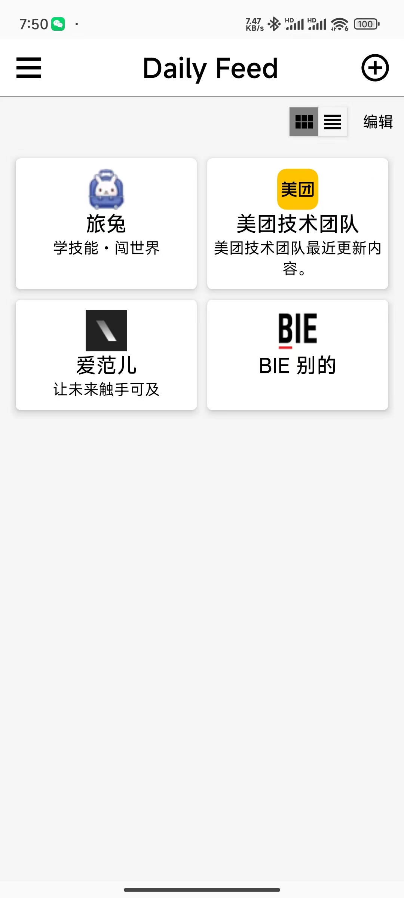
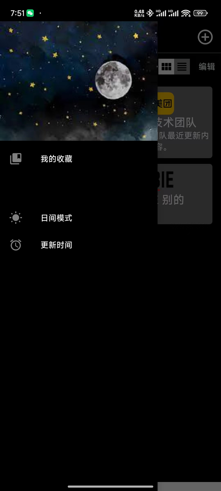

# DailyFeed
### 项目目标：

实现一款RSS阅读器（https://www.notion.so/RSS-Source-2021-RSS-1e1694d953ae4b529142b1128bfef084）

### 包含内容：

1. RSS源管理
   1. 添加、删除源；
   2. 【挑战⭐️⭐️】源内容展示支持列表和网格方式；
   3. 【挑战⭐️⭐️⭐️⭐️⭐️】列表支持单选、多选；侧滑菜单；拖拽能力（参考craft选区交互）
2. RSS内容下载&解析
   1. 运行在独立进程，与显示RSS进程分开
   2. 【挑战⭐️⭐️】支持定时更新内容，并通过通知提示
   3. 【挑战⭐️⭐️⭐️】需要保证这里的处理性能
3. RSS列表内容展示
   1. 将解析的数据进行列表展示
   2. 支持下拉刷新内容
   3. 支持侧滑搜藏和取消搜藏功能
   4. 【挑战⭐️⭐️】支持将内容分享到微信
4. RSS内容搜藏和离线展示
   1. 能够搜藏和取消搜藏
   2. 列表展示搜藏的内容
   3. 【挑战⭐️⭐️⭐️】支持断网可以访问
   4. 【挑战⭐️⭐️⭐️】针对搜藏的搜索功能
5. RSS内容展示
   1. 支持显示文字和图片
   2. 【挑战⭐️⭐️⭐️】支持将内容导出为本地图片、分享到微信
   3. 【挑战⭐️⭐️⭐️】支持对RSS内容的本地评论（参考飞书文档，支持局部评论和全文评论）
6. RSS整体页面功能
   1. 【挑战⭐️⭐️⭐️】支持设置全局主题，一键换肤
   2. 支持内容展示页面设置文字大小、间距等
   3. 通用控件实现

### 成品展示

1. 主界面

   

2. 文章列表页

   

3. 内容详情页

   

4. 夜间模式展示

   
